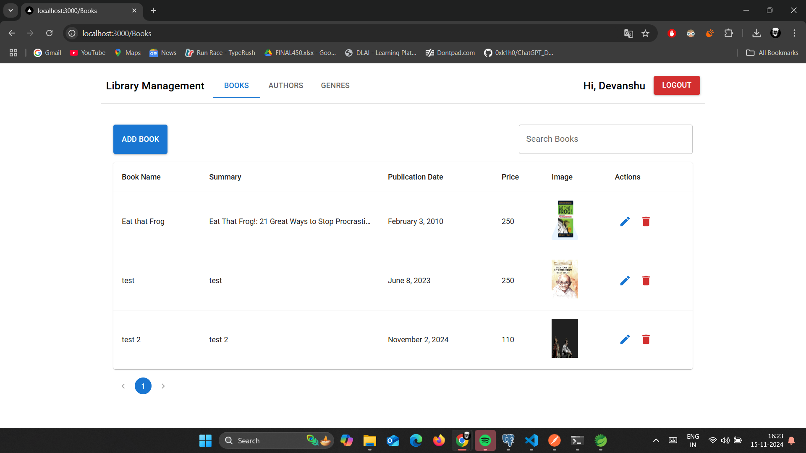
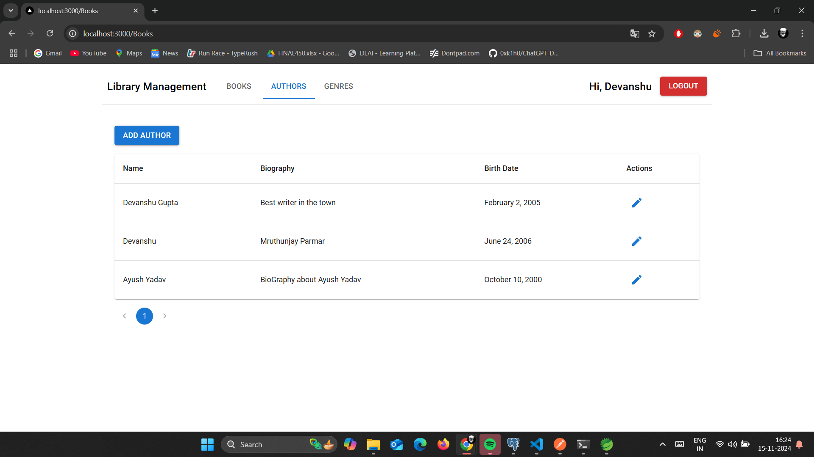
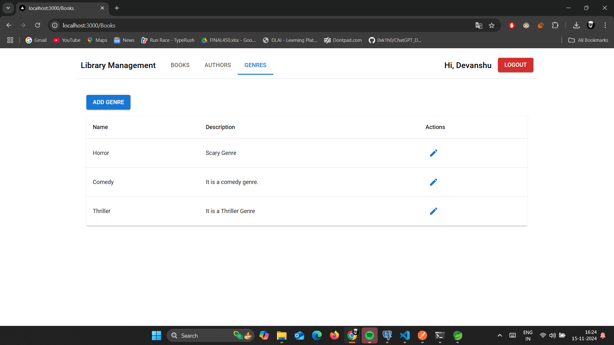
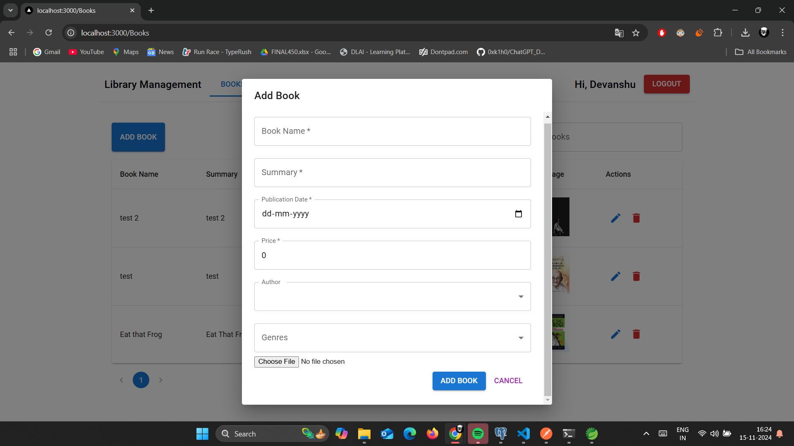

# Library Management System

An intuitive Library Management System built with modern web technologies to manage books, authors, and genres efficiently.

## Features

### 1. Books Management
- Add, edit, delete, and view books.
- Upload book cover images.
- Search for books by name, author and genre.
- Paginated list of books.

### 2. Authors Management
- Add, edit author details.
- Validation to ensure proper data (e.g., birth date before the current date).

### 3. Genres Management
- Add, edit genres.
- View all available genres.

### 4. Authentication
- User login/logout functionality.
- Restricts book, author, and genre management to authenticated users.

---

## Technologies Used

### Frontend
- **React** with **TypeScript** for building the user interface.
- **Material UI (MUI)** for UI components and styling.
- **Redux Toolkit** for state management.
- **Axios** for API calls.

### Backend
- **Spring Boot** for API development.
- **RESTful API** with CRUD operations.
- **Hibernate** for ORM and database interaction.
- **PostgreSQL/MySQL** as the database.

---

## Installation

### Prerequisites
- **Node.js** (v16+)
- **npm** or **yarn**
- Backend API running (Spring Boot server).

### Steps to Run the Project
1. Clone the repository:
    ```bash
    https://github.com/Mr-DevanshuGupta/LibraryManagement.git
    cd LibraryManagement
    ```

2. Install dependencies:
    ```bash
    npm install
    ```
    or
    ```bash
    yarn install
    ```

4. Start the application:
    ```bash
    npm start
    ```
    or
    ```bash
    yarn start
    ```

5. Open the application in your browser:
    ```
    http://localhost:3000
    ```

---

## API Endpoints

The system interacts with the backend API. Below are some key endpoints:

### Books
- `GET /books/`: Fetch all books.
- `POST /books/`: Add a new book.
- `PUT /books/{id}`: Update book details.
- `DELETE /books/{id}`: Delete a book.

### Authors
- `GET /author/`: Fetch all authors.
- `POST /author/`: Add a new author.
- `PUT /author/{id}`: Update author details.

### Genres
- `GET /genres/`: Fetch all genres.
- `POST /genres/`: Add a new genre.
- `PUT /genres/{id}`: Update genre details.

---


## Screenshots

### Books


### Authors


### Genres


### Add Book Form

